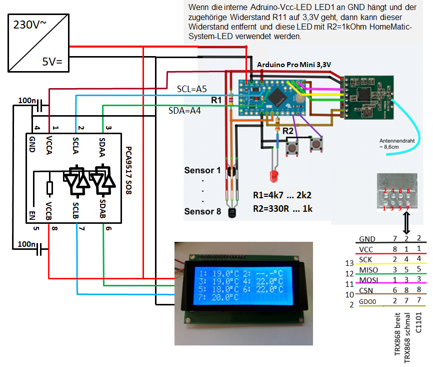
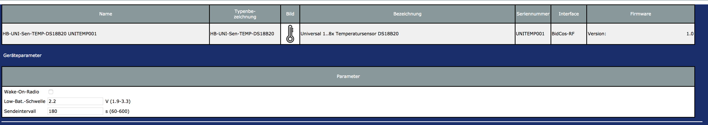

# HB-UNI-Sen-TEMP-DS18B20
## Funk "8fach Universal-Temperatursensor" für die Integration in HomeMatic

Einfache Variante ohne LCD Display:

<br><br>
Variante mit LCD Display:



## Benötigte Hardware
* 1x Arduino Pro Mini **ATmega328P (3.3V / 8MHz)**
* 1x CC1101 Funkmodul **(868 MHz)**, eventuell von einem alten, defektem HM-Gerät (Pinbelegung beachten!)
* 1x FTDI Adapter (wird nur zum Flashen benötigt)
* 1x ... 2x Taster (beliebig... irgendwas, das beim Draufdrücken schließt :smiley:)
* 1x LED 
* 1x Widerstand R1 4,7k (ausprobieren, bei langen Leitungen wird ein 2,2k Widerstand benötigt)
* 1x Widerstand R2 = 330 Ohm ... 1kOhm 
* 1x ... 8x DS18B20 Temperatursensor(en)
* 1x LCD-Modul (optional) mit 4 Zeilen á 20 Zeichen und mit I²C-Schnittstelle
* 1x I²C-Pegelwandler 3,3V - 5V, z.B. PCA9517
* Draht, um die Komponenten zu verbinden
* 1x 5V-Netzteil oder Batterie mit Halter

Für Batteriebetrieb: Um die Batterielebensdauer zu erhöhen, ist es unbedingt notwendig, die grüne LED sowie den LDO vom Arduino Pro Mini (die 2 roten X auf dem Schaltplan) (oder deren Vorwiderstand) abzulöten, oder mit einem kleinen Schraubendreher oder Messer von der Platine zu entfernen. Unbedingt aufpassen, dass keine Leiterbahnen zerstört werden.

Die Funkmodule sind immer für 3,3V-Betrieb ausgelegt. Daher wird auch ein 3,3V-Arduino verwendet. Die LCD-Module sind für 5V ausgelegt und auch das hier verwendete I2C-Interface PCF8574 wird mit 5V betrieben. Und dieses benötigt gemäß Spezifikation als High-Level von SDA und SCL mindestens 0,7 * VDD = 0,7 * 5V = 3,5V. Ohne einen Pegelwandler könnte es insbesondere bei auf z.B. 4,5V abgesenkter LCD-Betriebsspannung auch ohne I²C-Pegelwandler funktionieren. Für einen sichere Betrieb ist so ein Pegelwanlder aber sehr zu empfehlen. Z.B. [PCA9517 Breakout](https://www.google.com/search?q=pca9517+breakout)

## Universalplatine
Wer eine eigene Platine herstellen möchte, kann auf eine Auswahl verschiedener vorgefertigter Layouts zurückgreifen.
z.B.:
- [PCB](https://github.com/alexreinert/PCB) von alexreinert
- [HMSensor](https://github.com/pa-pa/HMSensor) von pa-pa

## Code flashen
- [AskSinPP Library](https://github.com/pa-pa/AskSinPP) in der Arduino IDE installieren
  - Achtung: Die Lib benötigt selbst auch noch weitere Bibliotheken, siehe [README](https://github.com/pa-pa/AskSinPP#required-additional-arduino-libraries).
- [Projekt-Datei](https://raw.githubusercontent.com/jp112sdl/HB-UNI-Sen-TEMP-DS18B20/master/HB-UNI-Sen-TEMP-DS18B20.ino) herunterladen.
- Arduino IDE öffnen
  - Heruntergeladene Projekt-Datei öffnen
  - Werkzeuge
    - Board: Arduino Pro or Pro Mini
    - Prozessor: ATmega328P (3.3V 8MHz) 
    - Port: entsprechend FTDI Adapter
einstellen
- Menü "Sketch" -> "Hochladen" auswählen.

## Addon installieren
Um die Geräteunterstützung zu aktivieren, wird die aktuellste Version des [JP-HB-Devices Addon](https://github.com/jp112sdl/JP-HB-Devices-addon/releases/latest) benötigt!

## Gerät anlernen
Wenn alles korrekt verkabelt und das Addons installiert ist, kann das Gerät angelernt werden.<br>
Über den Button "Gerät anlernen" in der WebUI öffnet sich der Anlerndialog.<br>
Button "HM Gerät anlernen" startet den Anlernmodus.<br>
Nun ist der Taster (an Pin D8) kurz zu drücken.<br>
Die LED leuchtet für einen Moment.<br>
Anschließend ist das Gerät im Posteingang zu finden.<br>
Dort auf "Fertig" geklickt, wird es nun in der Geräteübersicht aufgeführt.<br>

<br><br>
Das Sendeintervall kann zwischen 60 und 600 Sekunden eingestellt werden. In diesem Intervall werden die Temperatur-Werte an die CCU oder sonstige direkt verknüpfte Geräte geschickt und auch im LCD-Display aktualisiert. Zum Ausgleich von Mess-Ungenauigkeiten kann je Kanal ein Offset eingestellt werden.<br>

<br><br>
In der CCU unter "Status und Bedienung" -> "Geräte" können die einzelnen Werte angezeigt werden.<br>


## LCD Display
Unterstützung von LCD-Displays mit 4x20 Zeichen und I2C-Interface. Z.B. [LCD-Display 4x20 I2C](https://www.google.com/search?q=LCD-Display+4x20+I2C)<br>
Der Anschluss erfolgt über die Hardware-I2C Pins des Pro Mini (SDA=A4, SCL=A5).<br>

Im Sketch sind bei den Zeilen<br>
```
//#define USE_LCD
//#define LCD_ADDRESS 0x27
```
die Kommentarzeichen `//` zu entfernen, sowie geg. die `LCD_ADDRESS` entsprechend anzupassen.
<br><br>


<br>
Bei mehr als 4 Sensoren erfolgt die Anzeige in 2 Spalten:


Der 2. Taster hat folgende Funktionen:
* kurz: LCD-Hintergrundbeleuchtung aus- bzw einschalten (toggle)
* lang: Umschaltung auf LCD-Anzeige der Seriennummer der DS18B20-Sensoren


Im Normalfall werden die angeschlossenen Temperatursensoren mit einem internen Algorithmus beim Power-On gesucht und in der gefundenen Reihenfolge angezeigt. Fällt ein Sensor aus oder weg, dann rücken die restlichen Sensoren beim nächsten Re-Boot nach. Und die Offset-Einstellungen passen nicht mehr. Wenn im Sketch in die Zeile 
```
const uint64_t SENSOR_ORDER[] = {0x0a5ff5d443b75128, 0x1c4ed678434a8b28, 0xd94a51d443d0a828};
```
Sensor-Seriennummern eingetragen werden, dann werden die Sensoren mit dieser Seriennummern den Kanälen 1, 2, ... zugeordnet. Und geg. weitere vorhandene Sensoren dahinter. Bei einer nicht gefundenen Seriennummer bleibt eine Lücke wie im Bild oben.

Bei weniger als 4 Sensoren werden von jedem Sensor 3 Temperaturwerte angezeigt:<br>

* In der 1. Spalte der aktuelle Wert, gemäß der Geräte-Einstellung "Sendeintervall" alle 60 ... 600 Sekunden aktualisiert
* In der 2. Spalte ein alter Wert. Dieser wird nach ELDER_N * Sendeintervall aktualisiert.
* In der 3. Spalte ein doppelt so alter Wert.
Der Wert von ELDER_N is im Sketch voreingestellt, z.B.
```
#define ELDER_N 10
```
Bei z.B. Sendeintervall = 60s und diesem ELDER_N-Wert = 10 werden die 2. und 3. Spalte alle 60s * 10 = 600s, d.h. alle 10 Minuten aktualisiert. Es wird dann der 10 Minuten und der 2 * 10 Minuten alte Wert eingetragen. Und diese beiden Spalten bleiben dann wieder 10 Minuten unverändert.
